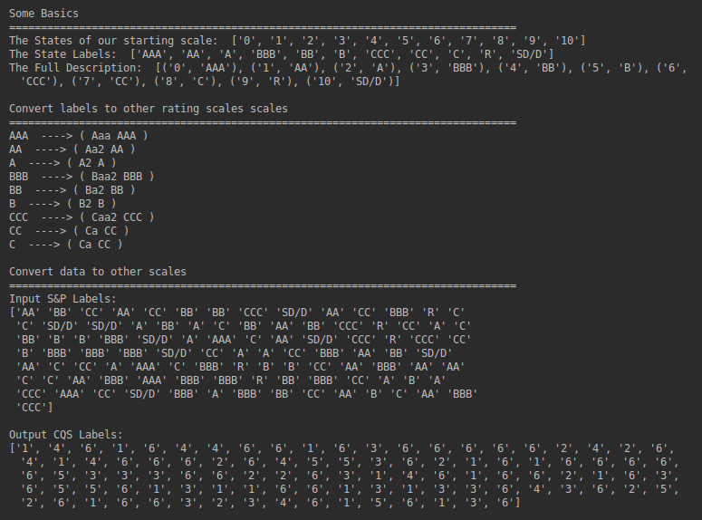

Intro
=========================
transitionMatrix is a Python powered library for the statistical analysis and visualization of state transition 
phenomena. It can be used to analyze any dataset that captures timestamped transitions in a discrete state space. 
Use cases include credit rating transitions, system state event logs etc. 

You can use transitionMatrix to

- Estimate transition matrices from historical event data using a variety of estimators
- Manipulate transition matrices (generators, comparisons etc.)
- Visualize event data and transition matrices
- Provide standardized data sets for testing
- Model transitions using threshold processes
- Map credit ratings using mapping tables between popularly used rating systems 

Key Information
================

* Author: [Open Risk](http://www.openriskmanagement.com)
* License: Apache 2.0
* Code Documentation: [Read The Docs](https://transitionmatrix.readthedocs.io/en/latest/index.html)
* Mathematical Documentation: [Open Risk Manual](https://www.openriskmanual.org/wiki/Transition_Matrix)
* Development website: [Github](https://github.com/open-risk/transitionMatrix)
* Project Chat: [Gitter Project](https://gitter.im/open-risk/transitionMatrix)

**NB: transitionMatrix is still in active development. If you encounter issues or have suggestions please raise them in our github repository**

Support and Training
=========================

* The Open Risk Academy has free courses demonstrating the use of the library. The current list is: 
    * [Analysis of Credit Migration using Python TransitionMatrix](https://www.openriskacademy.com/course/view.php?id=38)
* Support for transitionMatrix and other open source libraries developed by [Open Risk](https://www.openriskmanagement.com) is available upon request

Examples
========

The [code documentation](https://transitionmatrix.readthedocs.io/en/latest/index.html) includes a large number of examples, jupyter notebooks and more. 

Plotting individual transition trajectories

Sampling transition data

Estimation of transition matrices using cohort methods

Estimation of transition matrices using duration methods

Visualization of a transition matrix

Visualization using a Logarithmic Sankey diagram

Generating stochastic process transition thresholds

Stressing Transition Matrices

Computation and Visualization of Credit Curves

Working with credit states

