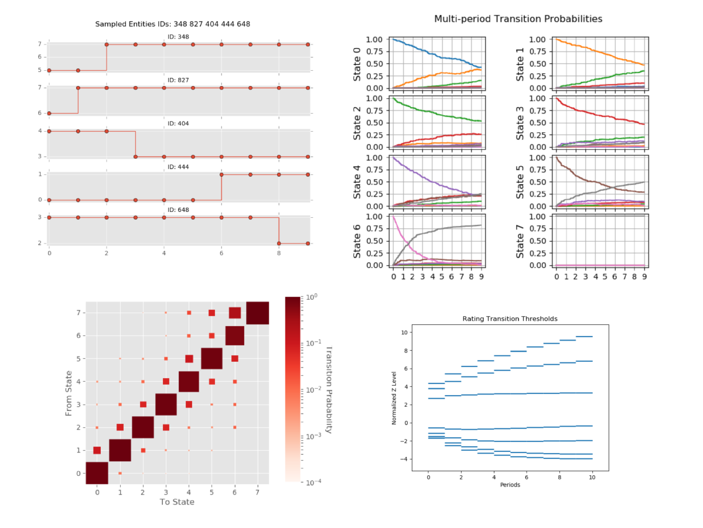

The transitionMatrix Library
=============================

transitionMatrix is a pure Python powered library for the statistical analysis and visualization of state transition phenomena. It can be used to analyze any dataset that captures *timestamped transitions in a discrete state space.*

* Author: `Open Risk <http://www.openriskmanagement.com>`_
* License: Apache 2.0
* Development Website: `Github <https://github.com/open-risk/transitionMatrix>`_
* Code Documentation: `Read The Docs <https://transitionmatrix.readthedocs.io/en/latest/>`_
* Mathematical Documentation: `Open Risk Manual <https://www.openriskmanual.org/wiki/Category:Transition_Matrix>`_
* Chat: `Gitter <https://gitter.im/open-risk/transitionMatrix>`_
* Training: `Open Risk Academy <https://www.openriskacademy.com/login/index.php>`_
* Showcase: `Blog Posts <https://www.openriskmanagement.com/tags/transition-matrix/>`_

Functionality
-------------

You can use transitionMatrix to:

- **Estimate** transition matrices from historical event data using a variety of estimators
- **Characterise** transition matrices (identify their key properties)
- **Visualize** event data and transition matrices
- **Manipulate** transition matrices (derive generators, perform comparisons, stress transition rates etc.)
- Access standardized :ref:`Datasets` for testing
- Extract and work with credit default curves (absorbing states)
- Map credit ratings using mapping tables
- More (still to be documented :-)

Architecture
------------

* transitionMatrix provides intuitive objects for handling transition matrices individually and as sets (based on numpy arrays)
* supports file input/output in json and csv formats
* it has a powerful API for handling event data (based on pandas and numpy)
* supports visualization using matplotlib

Installation
=======================

You can install and use the transitionMatrix package in any system that supports the `Scipy ecosystem of tools <https://scipy.org/install.html>`_

Dependencies
-----------------

- TransitionMatrix requires Python 3 (currently 3.7)
- It depends on numerical and data processing Python libraries (Numpy, Scipy, Pandas).
- The Visualization API depends on Matplotlib.
- The precise dependencies are listed in the requirements.txt file.
- TransitionMatrix may work with earlier versions of python / these packages but it is not tested.

From PyPI
-------------

.. Todo:: PyPI might not have the latest code

.. code:: bash

    pip3 install transitionMatrix

From sources
-------------

Download the sources in your preferred directory:

.. code:: bash

    git clone https://github.com/open-risk/transitionMatrix

Using virtualenv
----------------

It is advisable to install the package in a virtualenv so as not to interfere with your system's python distribution

.. code:: bash

    virtualenv -p python3 tm_test
    source tm_test/bin/activate

If you do not have pandas already installed make sure you install it first (this will also install numpy and other required dependencies).

.. code:: bash

    pip3 install -r requirements.txt

Finally issue the install command and you are ready to go!

.. code:: bash

    python3 setup.py install

File structure
-----------------
The distribution has the following structure:

::

    | transitionMatrix/     Directory with the library source code
    | -- model.py           File with main data structures
    | -- estimators/        Directory with the estimator methods
    | -- statespaces/       Directory with state space objects and methods
    | -- creditratings/     Directory with predefined credit rating structures
    | -- generators/        Directory with data generator methods
    | -- utils/             Directory with helper classes and methods
    | -- examples/          Directory with usage examples
    | ---- python/          Examples as standalone python scripts
    | ---- notebooks/       Examples as jupyter notebooks
    | -- datasets/          Directory with a variety of datasets useful for getting started
    | -- tests/             Directory with the testing suite

Other similar open source software
-----------------------------------

- etm, an R package for estimating empirical transition matrices
- msSurv, an R Package for Nonparametric Estimation of Multistate Models
- msm, Multi-state modelling with R
- mstate, competing risks and multistate models in R
- lifelines, python survival package
