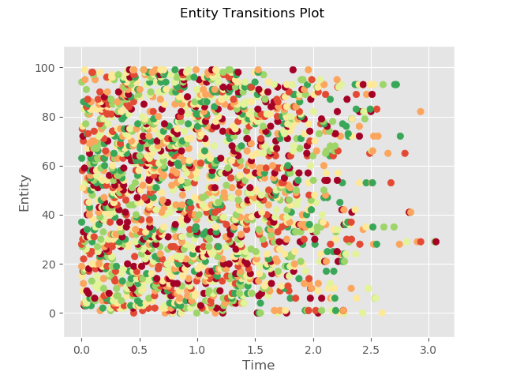
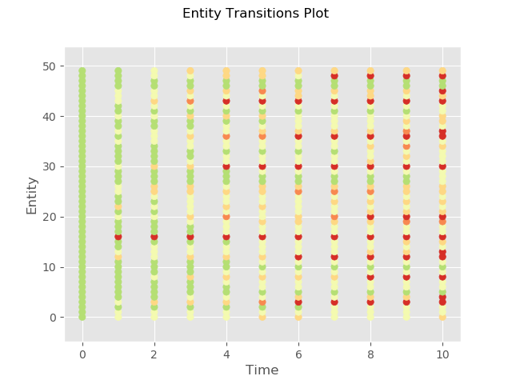

Examples
========

The examples directory includes python scripts and jupyter notebooks to help you get started

- Generating transition matrices from data
- Manipulating transition matrices
- Computing and visualizing credit curves corresponding to a set of transition matrices
- Estimating thresholds given a multi-period transition matrix set
- Generating loss distributions analytically

Python Scripts
-------------------------------------------

Located in examples/python (For testing purposes all examples can be run using the run_examples.py script
located in the root directory)

Matrix Operations
^^^^^^^^^^^^^^^^^^^^^^^^^^^^^^^^^^^^^^^^

* matrix_set_operations.py

Examples using transitionMatrix to perform various transition matrix operations

Adjust NR States
^^^^^^^^^^^^^^^^^^^^^^^^^^^^^^^^^^^^^^^^

* adjust_nr_states.py

Example of using transitionMatrix adjust the (not-rated) NR state. Input data are the Standard
and Poor's historical data (1981 - 2016) for corporate credit rating migrations. Example of handling
`right censoring issues <https://www.openriskmanual.org/wiki/Withdrawn_Ratings>`_

Fix Multiperiod Matrix
^^^^^^^^^^^^^^^^^^^^^^^^^^^^^^^^^^^^^^^^^^^^^^^^^^^^^^

* fix_multiperiod_matrix.py

Example of using transitionMatrix to detect and solve various pathologies that might be affecting transition
matrix data

Generate Full Multiperiod Set
^^^^^^^^^^^^^^^^^^^^^^^^^^^^^^^^^^^^^^^^

* generate_full_multiperiod_set.py

Example of using the transitionMatrix generator methods to generate a full multi-period matrix set
The input data are processed Standard and Poor's matrices for a selection of cumulative observation points
NB: This example requires a substantial amount of custom code!

Generate Synthetic Data
^^^^^^^^^^^^^^^^^^^^^^^^^^^^^^^^^^^^^^^^

* generate_synthetic_data.py

Example workflows using transitionMatrix to generate synthetic data.
(Edit the dataset selector to switch between examples)

The first set of examples produce "duration" type data. Estimating transitions
for duration data is done directly with duration type estimators or after
cohorting (binning) the data for cohort (frequency) type estimators.

The subsequent set of examples produce cohort type data using markov chain simulation

Matrix from Cohort Data
^^^^^^^^^^^^^^^^^^^^^^^^^^^^^^^^^^^^^^^^

* matrix_from_cohort_data.py

Example workflows using transitionMatrix to estimate a transition matrix from data that are
already grouped in cohorts

Matrix from Duration Data
^^^^^^^^^^^^^^^^^^^^^^^^^^^^^^^^^^^^^^^^

* matrix_from_duration_data.py

Example workflows using transitionMatrix to estimate a transition matrix from data that are
in duration format. The datasets are first grouped in period cohorts

Matrix from LendingClub Data
^^^^^^^^^^^^^^^^^^^^^^^^^^^^^^^^^^^^^^^^

* matrix_lendingclub.py
* matrix_set_lendingclub.py

Example workflows using transitionMatrix to estimate a matrix from LendingClub data
Input data are in a special cohort format as the published datasets have some limitations

Calculate and Plot Credit Curves
^^^^^^^^^^^^^^^^^^^^^^^^^^^^^^^^^^^^^^^^^^^^^^^^^^^^^^^^^^^^

* credit_curves.py

Example of using transitionMatrix to calculate and visualize multi-period
`Credit Curves <https://www.openriskmanual.org/wiki/Category:Credit_Curve>`_

.. image:: ../../examples/credit_curves.png

Empirical Transition Matrix
^^^^^^^^^^^^^^^^^^^^^^^^^^^^^^^^^^^^^^^^^^^^^^^^^^^^^^^^^^^^^

* empirical_transition_matrix.py

Example workflows using transitionMatrix to estimate an empirical transition matrix from duration type data
The datasets are produced in examples/generate_synthetic_data.py This example uses the
`Aalen-Johansen estimator <https://www.openriskmanual.org/wiki/Aalen-Johansen_Estimator>`_

Plot of estimated transition probabilities

.. image:: ../../examples/transition_probabilities.png

Rating Transition Thresholds
^^^^^^^^^^^^^^^^^^^^^^^^^^^^^^^^^^^^^^^^^^^^^^^^^^^^^^^^^^

* calculate_thresholds.py
* validated_thresholds.py
* visualize_thresholds.py

Example of using transitionMatrix to compute multi-period transition thresholds
compatible with a given transition matrix. Validate computed thresholds.

The mathematical framework documented in
`Multi-Period Transition Thresholds <https://www.openriskmanual.org/wiki/Multi-Period_Transition_Thresholds>`_

.. image:: ../../examples/Thresholds.png

Portfolio Model
^^^^^^^^^^^^^^^^^^^^^^^^^^^^^^^^^^^^^^^^

* portolio_model.py

Using the portfolio model library to calculate default probabilities in finite
portfolio with N credits

Generate Visuals
^^^^^^^^^^^^^^^^^^^^^^^^^^^^^^^^^^^^^^^^

* generate_visuals.py

Example workflows using transitionMatrix to generate visualizations of migration phenomena

Example 1
""""""""""""""""""""""""""""
Plotting the state space trajectory of a single entity

.. image:: ../../examples/single_entity.png

Example 2
""""""""""""""""""""""""""""
Plotting the state space trajectory of multiple entities

.. image:: ../../examples/sampled_histories.png

Example 3
""""""""""""""""""""""""""""
Histogram plot of transition frequencies

.. image:: ../../examples/estimation.png

Example 4
""""""""""""""""""""""""""""
Colored scatterplot of entity transitions over time

Example 5
""""""""""""""""""""""""""""
Colored scatterplot of entity transitions over time (alternative form)

Example 6
""""""""""""""""""""""""""""
Visualize a transition matrix using Hinton-style visual

.. image:: ../../examples/TransitionMatrix.png

Jupyter Notebooks
-------------------------------------------

* Adjust_NotRated_State.ipynb
* Matrix_Operations.ipynb
* Portfolio_Examples.ipynb
