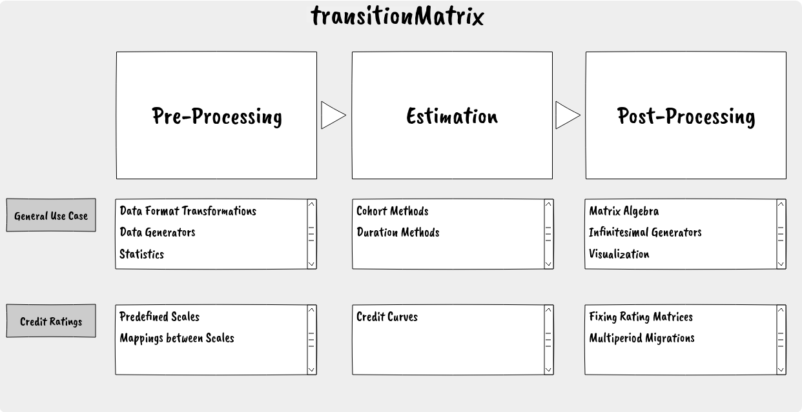

Getting Started
===============

The transitionMatrix components
-------------------------------

The transitionMatrix package includes several components (organized in sub-packages) providing a variety of functionality for working with state transition phenomena. The overall organization and functionality is summarized in the following graphic:

The library is structured in a modular way: users may mix and match the various components to meet their own needs. The main workflow can be captured in the standard pre-processing, modelling and post-processing stages:

- :ref:`pre-processing` stage
- :ref:`estimation` stage
- :ref:`post-processing` stage

An secondary segmentation that is important to keep in mind is between general functionality that is relevant to general data about state transitions and more specific domains with more specific conventions and needs. At present the only specific domain concerns `credit ratings <https://www.openriskmanual.org/wiki/Credit_Rating>`_.

Here we will dive straight-in into using transitionMatrix going a concrete (and typical) example using historical credit rating transitions. Further resources and links to more detailed and specific usage are available at the end of this section. People who are not at all familiar with the machinery of transition matrices might want to start with :ref:`Basic Operations`.

An end-to-end usage example from credit risk
---------------------------------------------
In order to give a quick introduction to the package we discuss here a concrete and end-to-end example of using transitionMatrix that is drawn for the credit ratings space. The example does not cover all functionality, but it demonstrates the core workflow.

We will use the data set "rating_data.csv" that is available in :ref:`Datasets` directory. The code snippets discussed here are all from the script <examples/python/estimate_matrix.py>

Step 1: Loading the data
^^^^^^^^^^^^^^^^^^^^^^^^^

Data loading is best done via pandas dataframes:

.. code::

    data = pd.read_csv('../../datasets/rating_data.csv')
    print(data.head())

       CustomerId        Date Rating  RatingNum
    0           1  30-05-2000   CCC+          7
    1           1  31-12-2000     B+          6
    2           2  21-05-2003     B+          6
    3           3  30-12-1999    BB+          5
    4           3  30-10-2000     B+          6

We see that there is just enough metadata in the csv header to get an impression of how the data set captures transitions:

* Each entity is identified by an integer (First column: CustomerId)
* State measurements / transitions are observed at dates (in the DD-MM-YYYY format) (Second column: Date)
* There is an implied credit rating scale using symbols 'B+, BB+' etc (Third column: Rating)
* The rating scale is also expressed as integers (Fourth column: RatingNum)

.. note::

    There are several important points we need to clarify before we can confidently extract information from this dataset and (ultimately) estimate a transition matrix. For example:

    * Do we understand the column labels or do we need additional (metadata)
    * What is the observation window?
    * Are the dates indicating a measurement (including no change) or a changed state?
    * Are all possible transitions observed in the sample?
    * Are all data provided consistent?
    * Etc

Some of those questions maybe answerable with the tools offered by transitionMatrix but it is always the responsibility of the data scientist to make sure they are correctly interpreting the data and using the tools accordingly! The

Step 2: Understanding the data format
^^^^^^^^^^^^^^^^^^^^^^^^^^^^^^^^^^^^^^

Our first task is to identify which data format is closest for us to use.  In :ref:`Input Data Formats` we see that what we have *looks* closest to a :ref:`Compact Form of Long Format` with the temporal information in :ref:`String Dates`.

Step 3: Data cleaning and normalization
^^^^^^^^^^^^^^^^^^^^^^^^^^^^^^^^^^^^^^^^

Having data in the right format is only the first step!

.. warning:: As mentioned above, we need to be careful that the input data are "clean" and have unambiguous interpretation. Here are some examples of potential issues:

  Example 1: The entity with ID=41 has only one measurement and it is NR. What does it mean? Can we remove it from the data without impact?

  - 40, 30-12-2003, A+, 3
  - 41, 21-07-2000, NR, 0
  - 42, 30-06-2004, A+, 3

  Example 2: ID 46 has three identical measurements at different times. What does it mean? Can we ignore the intermediate observations without impact? (Observing a no-change is no the same as not observing a change!)

  - 46, 30-05-1999, AA+, 2
  - 46, 30-08-2001, AA+, 2
  - 46, 30-12-2002, AA+, 2
  - 46, 30-12-2003, A+, 3

Example 3: ID 54 is transitioning to D (absorbing state) and then to NR. This means that the label 'NR' is used in multiple ways: Something that is not rated because we know its state anyway (D) and something that

  - 54,30-10-2001, CCC+, 7
  - 54,30-07-2002, D, 8
  - 54,30-12-2002, NR, 0

Those examples illustrate that converting the raw input data into a clean dataset might require additional assumptions. This must be done on a case-by-case basis. For example: if an entity is only observed once in a state, maybe it is valid to assume it is in that state throughout the observation window. Another example: maybe it is valid to assume that multiple observations of no changing state do not carry any information and thus can be merged, etc.

.. note:: For a (non-exhaustive) list of data cleaning steps check out the script examples/python/data_cleaning_example.py

Step 4: Establish the State Space
^^^^^^^^^^^^^^^^^^^^^^^^^^^^^^^^^^

Lets rename the columns accordingly:

.. code::

    data = data.rename(columns={"Rating": "State", "Date": "Time", "CustomerId": "ID"})
    print(unique_states(data))

    ['CCC+' 'B+' 'BB+' 'AA+' 'A+' 'BBB+' 'NR' 'D' 'AAA']

We see that we have 9 unique states:

* 7 ratings states: AAA, AA+, etc presumably refer to different credit qualities (it is typical when the rating scale uses the (+) qualifier to also have (-) but here this is not the case).
* D probably means an *absorbing* (Default) state
* NR probably means *not rated*

Let us create the State Space

.. code::

    originator = 'me'
    full_name = 'my state space'
    definition = [('0', 'NR'), ('1', "AAA"), ('2', "AA+"), ('3', "A+"), ('4', "BBB+"),
                  ('5', "BB+"), ('6', "B+"), ('7', "CCC+"),
                  ('8', "D")]

    mySS = StateSpace(definition=definition, originator=originator, full_name=full_name, cqs_mapping=None)

    print(mySS.validate_dataset(data))

.. note::

    The above shows the functionality of the StateSpace object. In this case the validation is expected as we constructed the labels from what we found on the data set, but if the rating scale we use is given this becomes a more insightful validation exercise

Further Resources
------------------
There is a large and growing set of examples and other training material to get you started:

Examples Directory
^^^^^^^^^^^^^^^^^^^^^^

Look at the :ref:`Usage Examples` directory of the transitionMatrix distribution for a variety of typical workflows.

.. note:: Many scripts contain *multiple examples*. You need to manually edit the example ID within the file to select the desired example

Open Risk Academy
^^^^^^^^^^^^^^^^^^^^^^

For more in depth study, the Open Risk Academy has courses elaborating on the use of the library:
    - `Analysis of Credit Migration using Python TransitionMatrix <https://www.openriskacademy.com/course/view.php?id=38>`_

.. note:: The Example scripts from the Open Risk Academy course PYT26038 are available in `a separate repo <https://github.com/open-risk/Academy-Course-PYT26038>`_