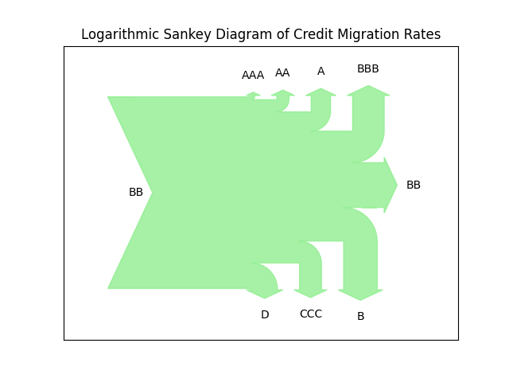

Visualization
===============

transitionMatrix aims to support native (Python-based) visualization of various transition related datasets using matplotlib and other native python visualization libraries.

.. note:: The visualization functionality is not yet refactored into a reusable API. For now the visualization functionality is implemented separately as a demo script.

Visualization Examples
----------------------

Example workflows using transitionMatrix to generate visualizations of migration phenomena

* Script: examples/python/generate_visuals.py

Example 1
""""""""""""""""""""""""""""
Plotting the state space trajectory of a single entity

.. image:: ../../examples/single_entity.png

Example 2
""""""""""""""""""""""""""""
Plotting the state space trajectory of multiple entities

.. image:: ../../examples/sampled_histories.png

Example 3
""""""""""""""""""""""""""""
Histogram plot of transition frequencies

.. image:: ../../examples/estimation.png

Example 4
""""""""""""""""""""""""""""
Colored scatterplot of entity transitions over time

.. image:: ../../examples/scatterplot.png

Example 5
""""""""""""""""""""""""""""
Colored scatterplot of entity transitions over time (alternative form)

.. image:: ../../examples/scatterplot2.png

Example 6
""""""""""""""""""""""""""""
Visualize a transition matrix using Hinton-style visual

.. image:: ../../examples/TransitionMatrix.png

Example 7
""""""""""""""""""""""""""""
Visualize a transition matrix using a sankey visual (a logarithmic adaptation that is useful for qualitative insight)

